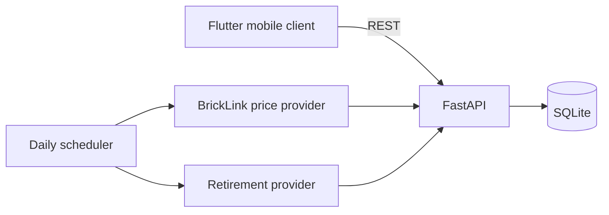

# Architecture

BrickTracker is organized as a local-first client with a Python service boundary.

## Responsibilities

- Flutter renders the dashboard, collection, analytics, price history, retirement groups, and watchlist; it does not calculate authoritative market values.
- FastAPI owns validation, portfolio calculations, and persistence.
- SQLite stores catalog data, collection positions, separate new and used price snapshots, retirement estimates, and notification preferences.
- `PriceProvider` and `RetirementProvider` isolate external data sources. A BrickLink implementation supplies price data; retirement data can later come from BrickEconomy, Rebrickable, LEGO.com, or a scraper without changing API, UI, or storage contracts.

## Value rule

For collection item $i$, current value is:

$$V_i = q_i \times \begin{cases}p_{new}, & \text{condition = sealed}\\p_{used}, & \text{condition = used}\end{cases}$$

Profit/loss is $V_i - q_i \times purchase\_price_i$.
